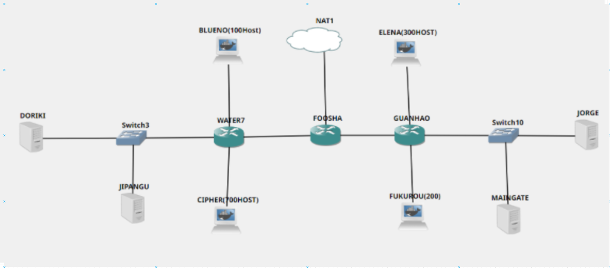
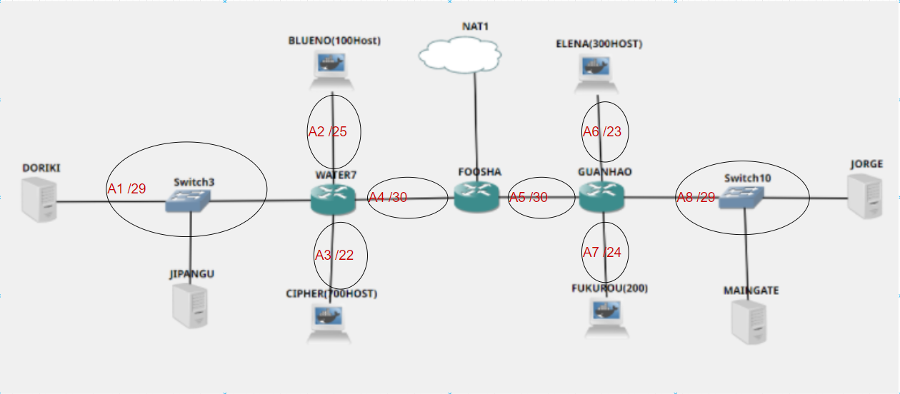
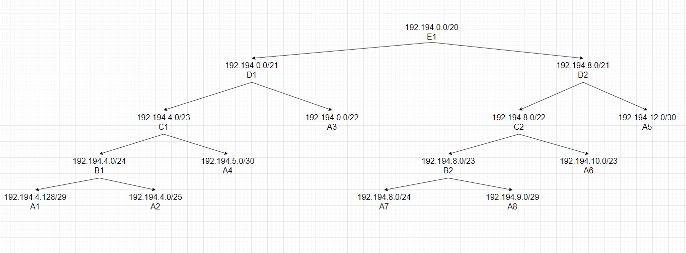
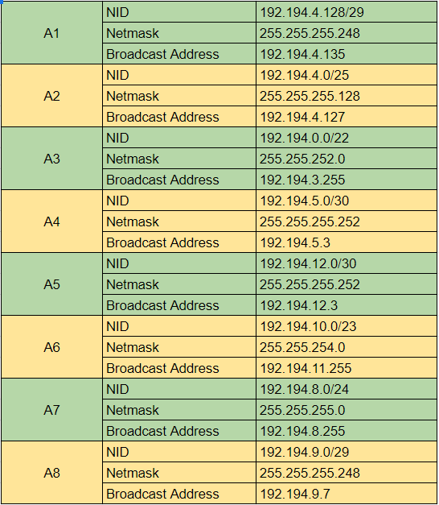
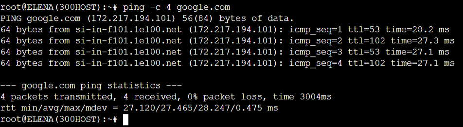
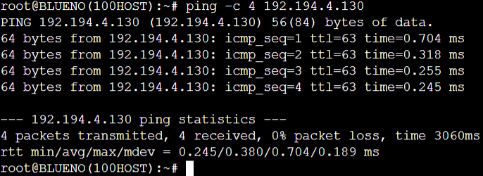
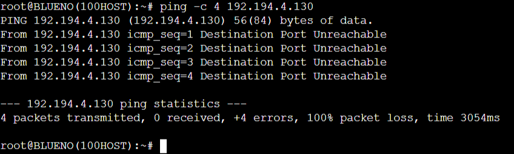
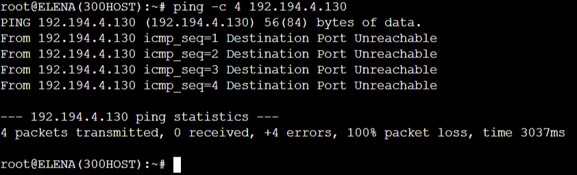
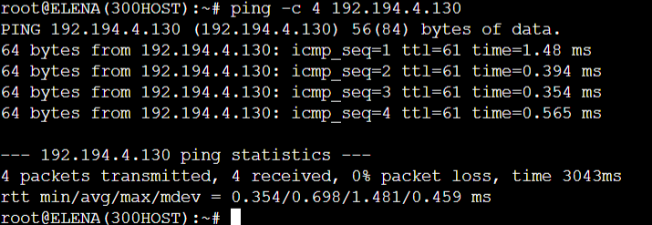

# Jarkom-Modul-5-D05-2021

## Anggota Kelompok D05

| Nama                          | NRP            |
| ----------------------------- | -------------- |
| Andika Nugrahanto             | 05111940000031 |
| Muhammad Rayhan Raffi Pratama | 05111940000110 |
| Fadhil Dimas Sucahyo          | 05111940000212 |

## Soal dan Pembahasan

### A

Soal : Tugas pertama kalian yaitu membuat topologi jaringan sesuai dengan rancangan yang diberikan Luffy dibawah ini

- Jipangu adalah DHCP Server
- Foosha, Water7, dan Guanhao adalah DHCP Relay
- Doriki adalah DNS Server
- Blueno, Cipher, Elena, dan Fukurou adalah client



### B

Soal : Karena kalian telah belajar subnetting dan routing, Luffy ingin meminta kalian untuk membuat topologi tersebut menggunakan teknik CIDR atau VLSM.

### Pembagian Subnet

Pembagian subnet menggunakan CIDR. Berdasarkan topologi yang telah dibuat, dapat ditentukan labelling netmask sebagai berikut



Berikut ini adalah jumlah ip untuk masing-masing subnet yang telah ditentukan.

| Subnet | Jumlah IP | Netmask |
| :----: | :-------: | :-----: |
|   A1   |     3     |   /29   |
|   A2   |    101    |   /25   |
|   A3   |    701    |   /22   |
|   A4   |     2     |   /30   |
|   A5   |     2     |   /30   |
|   A6   |    301    |   /23   |
|   A7   |    201    |   /24   |
|   A8   |     3     |   /29   |

Untuk penggabungan CIDR dapat dilihat di <a href="https://docs.google.com/spreadsheets/d/13OMgRNHS2Clw0rjyUSRwQfsrd-LHccGwSyX0zUvJqDc/edit?usp=sharing">sini</a>

### Pembagian IP

Berikut adalah pembagian IP yang diilustrasikan menggunakan tree. Pada tree berikut dapat diketahui network ID yang dapat digunakan untuk masing-masing subnet.



Berikut adalah tabel pembagian IP untuk subnet A1 hingga A8 yang terdiri dari Network ID, Netmask, dan Broadcast Address. Tabel ini dibuat untuk memudahkan pemberian IP pada GNS3.



### C

Soal : Setelah melakukan subnetting, kalian juga diharuskan melakukan Routing agar setiap perangkat pada jaringan tersebut dapat terhubung.

Sebelum melakukan routing, membuat konfigurasi untuk masing-masing node pada `Configure > Edit Network Configuration`. Konfigurasi ini dilakukan supaya kita dapat mengetahui IP address dan gateway masing-masing node sehingga dapat saling dihubungkan saat membuat routing. Berikut adalah salah satu konfigurasi yang dilakukan, yaitu pada router Foosha

```
auto eth0
iface eth0 inet static
	address 192.168.122.2
	netmask 255.255.255.252
        gateway 192.168.122.1

auto eth1
iface eth1 inet static
	address 192.194.5.1
	netmask 255.255.255.252

auto eth2
iface eth2 inet static
	address 192.194.12.1
	netmask 255.255.255.252
```

Kemudian, Routing dilakukan antar router pada Foosha, Water7, dan Guanhao

- Foosha

```
route add -net 192.194.0.0 netmask 255.255.248.0 gw 192.194.5.2
route add -net 192.194.8.0 netmask 255.255.248.0 gw 192.194.12.2
```

- Water7

```
route add -net 192.194.4.0 netmask 255.255.255.128 gw 192.194.4.2
route add -net 192.194.4.128 netmask 255.255.255.248 gw 192.194.4.130
route add -net 192.194.4.128 netmask 255.255.255.248 gw 192.194.4.131
route add -net 192.194.0.0 netmask 255.255.252.0 gw 192.194.0.2
```

- Guanhao

```
route add -net 192.194.10.0 netmask 255.255.254.0 gw 192.194.10.2
route add -net 192.194.9.0 netmask 255.255.255.248 gw 192.194.9.2
route add -net 192.194.9.0 netmask 255.255.255.248 gw 192.194.9.3
route add -net 192.194.8.0 netmask 255.255.255.0 gw 192.194.8.2
```

### D

Soal : Tugas berikutnya adalah memberikan IP pada subnet Blueno, Cipher, Fukurou, dan Elena secara dinamis menggunakan bantuan DHCP server. Kemudian kalian ingat bahwa kalian harus setting DHCP Relay pada router yang menghubungkannya.

DHCP Server diletakkan pada Jipangu dengan file konfigurasi `/etc/dhcp/dhcpd.conf`sebagai berikut. Konfigurasi ini digunakan untuk memberikan IP address untuk masing-masing client.

```
subnet 192.194.4.128 netmask 255.255.255.248 {
}

subnet 192.194.4.0 netmask 255.255.255.128 {
        range 192.194.4.2 192.194.4.126;
        option routers 192.194.4.1;
        option broadcast-address 192.194.4.127;
        option domain-name-servers 192.194.4.130;
        default-lease-time 600;
        max-lease-time 600;
}

subnet 192.194.0.0 netmask 255.255.252.0 {
        range 192.194.0.2 192.194.3.254;
        option routers 192.194.0.1;
        option broadcast-address 192.194.3.255;
        option domain-name-servers 192.194.4.130;
        default-lease-time 600;
        max-lease-time 600;
}

subnet 192.194.10.0 netmask 255.255.254.0 {
        range 192.194.10.2 192.194.11.254;
        option routers 192.194.10.1;
        option broadcast-address 192.194.11.255;
        option domain-name-servers 192.194.4.130;
        default-lease-time 600;
        max-lease-time 600;
}

subnet 192.194.8.0 netmask 255.255.255.0 {
        range 192.194.8.2 192.194.8.254;
        option routers 192.194.8.1;
        option broadcast-address 192.194.8.255;
        option domain-name-servers 192.194.4.130;
        default-lease-time 600;
        max-lease-time 600;
}
```

Supaya client dapat terhubung dengan internet, pada file konfigurasi `/etc/dhcp/dhcpd.conf` diarahkan menuju `eth0` yaitu interface yang mengarah ke router. Kemudian, menambahkan file konfigurasi `/etc/default/isc-dhcp-relay` untuk DHCP Relay pada router Water7, Foosha, dan Guanhao sebagai berikut

```
SERVERS="192.194.4.131"
INTERFACES="eth0 eth1 eth2 eth3"
OPTIONS=""
```

IP `192.194.4.131` adalah IP Address dari DHCP Server yaitu Jipangu, lalu mengarahkan interface pada `eth0 eth1 eth2 eth3` supaya DHCP Relay dapat meneruskan DHCP request pada DHCP Server

### No 1

Soal :
Agar topologi yang kalian buat dapat mengakses keluar, kalian diminta untuk mengkonfigurasi Foosha menggunakan iptables, tetapi Luffy tidak ingin menggunakan MASQUERADE.

Jawaban :

Pada Foosha ditambahkan rule Iptables di bawah ini:

```bash
iptables -t nat -A POSTROUTING -s 192.194.0.0/20 -o eth0 -j SNAT --to-source 192.168.122.2
```

Selain itu, agar klien dapat mengakses ke luar, maka perlu ditambahkan forwarding pada DNS Server yaitu **Doriki** pada file `/etc/bind/named.conf.options`, uncomment pada bagian (0.0.0.0 diubah menjadi 192.168.122.1):

```
forwarders {
    192.168.122.1;
};
```

Comment pada bagian ini

```
// dnssec-validation auto;
```

Dan tambahkan

```
allow-query{any;};
```

Kemudian tes dengan `ping google.com` pada salah satu klien


### No 2

Soal :
Kalian diminta untuk mendrop semua akses HTTP dari luar Topologi kalian pada server yang merupakan DHCP Server dan DNS Server demi menjaga keamanan.

Jawaban :
Pada Foosha ditambahkan rule Iptables di bawah ini:

```bash
iptables -A FORWARD -d 192.194.4.128/29 ! -s 192.194.0.0/20 -i eth0 -p tcp --dport 80 -j DROP
```

### No 3

Soal :
Karena kelompok kalian maksimal terdiri dari 3 orang. Luffy meminta kalian untuk membatasi DHCP dan DNS Server hanya boleh menerima maksimal 3 koneksi ICMP secara bersamaan menggunakan iptables, selebihnya didrop.

Jawaban :
Pada Jipangu dan Doriki ditambahkan rule Iptables di bawah ini:

```bash
iptables -A INPUT -m state --state ESTABLISHED,RELATED -j ACCEPT
iptables -A INPUT -p icmp -m connlimit --connlimit-above 3 --connlimit-mask 0 -j DROP
```

Dapat dites dengan mengeping jipangu/doriki dari 4 node berbeda, dimana pada node ke 4 tidak akan berhasil melakukan ping.

### No 4

Soal :
Kemudian kalian diminta untuk membatasi akses ke Doriki yang berasal dari subnet Blueno, Cipher, Elena dan Fukuro dengan beraturan sebagai berikut
Akses dari subnet Blueno dan Cipher hanya diperbolehkan pada pukul 07.00 - 15.00 pada hari Senin sampai Kamis.

Jawaban :
Pada Doriki ditambahkan rule Iptables di bawah ini:

```bash
## Batas Akses Doriki Dari Cipher
iptables -A INPUT -s 192.194.0.0/22 -m time --timestart 07:00 --timestop 15:00 --weekdays Mon,Tue,Wed,Thu -j ACCEPT
iptables -A INPUT -s 192.194.0.0/22 -j REJECT

##Batas Akses Doriki Dari Blueno
iptables -A INPUT -s 192.194.4.0/25 -m time --timestart 07:00 --timestop 15:00 --weekdays Mon,Tue,Wed,Thu -j ACCEPT
iptables -A INPUT -s 192.194.4.0/25 -j REJECT
```

dapat dites dengan melakukan ping dari Cipher/Blueno ke Doriki
Jam 10:00:


Jam 17:00:


### No 5

Soal :
Akses dari subnet Elena dan Fukuro hanya diperbolehkan pada pukul 15.01 hingga pukul 06.59 setiap harinya.

Jawaban :
Pada Doriki ditambahkan rule Iptables di bawah ini:

```bash
##Batas Akses Doriki Dari Elena
iptables -A INPUT -s 192.194.10.0/23 -m time --timestart 15:01 --timestop 23:59 -j ACCEPT
iptables -A INPUT -s 192.194.10.0/23 -m time --timestart 00:00 --timestop 06:59 -j ACCEPT
iptables -A INPUT -s 192.194.10.0/23 -j REJECT

##Batas Akses Doriki Dari Fukurou
iptables -A INPUT -s 192.194.8.0/24 -m time --timestart 15:01 --timestop 23:59 -j ACCEPT
iptables -A INPUT -s 192.194.8.0/24 -m time --timestart 00:00 --timestop 06:59 -j ACCEPT
iptables -A INPUT -s 192.194.8.0/24 -j REJECT
```

dapat dites dengan melakukan ping dari Elena/Fukurou ke Doriki
Jam 10:00:


Jam 17:00:


### No 6

Soal :
Karena kita memiliki 2 Web Server, Luffy ingin Guanhao disetting sehingga setiap request dari client yang mengakses DNS Server akan didistribusikan secara bergantian pada Jorge dan Maingate

Jawaban :
Ditambahkan perintah iptables sebagai berikut di Guanhao:

```
iptables -t nat -A PREROUTING -p tcp -d 192.194.13.1 --dport 80 -m statistic --mode nth --every 2 --packet 0 -j DNAT --to-destination 192.194.9.2:80
iptables -t nat -A PREROUTING -p tcp -d 192.194.13.1 --dport 80 -j DNAT --to-destination 192.194.9.3:80
iptables -t nat -A POSTROUTING -p tcp -d 192.194.9.2 --dport 80 -j SNAT --to-source 192.194.13.1:80
iptables -t nat -A POSTROUTING -p tcp -d 192.194.9.3 --dport 80 -j SNAT --to-source 192.194.13.1:80
```

Pada Jorge dan Maingate yang merupakan Web Server harus dilakukan instalasi apache2 dengan perintah `apt-get install apache2`. Kemudian membuat sites-available `jarkom.d05.com`.

Kemudian pada DNS Server yaitu Doriki akan diinstall bind9 dengan perintah `apt-get install bind9`. Setelah itu dilakukan edit file `/etc/bind/named.conf.local` dan tambahkan domain baru misalkan **jarkom.d05.com** sebagai berikut:

```
zone "jarkom.d05.com" {
    type master;
    file "/etc/bind/jarkom/jarkom.d05.com";
};
```

Kemudian buat folder baru: `mkdir /etc/bind/jarkom`

Dan copy file `db.local` ke folder yang baru saja dibuat dan mengganti namanya sesuai domain yang diinginkan: `cp /etc/bind/db.local /etc/bind/jarkom/jarkomd07.com`
Kemudian buka file `jarkomd07.com` dengan perintah: nano /etc/bind/jarkom/jarkomd07.com.

Edit pointer **A** menjadi ke IP yang belum digunakan yaitu **192.194.13.1** serta ganti localhost menjadi nama domain yaitu **jarkom.d05.com**.

Setelah itu melakukan restart service bind9 dengan perintah `service bind9 restart`.

Untuk mengecek, misalkan pada klien Elena dan Cipher dijalankan `lynx jarkom.d05.com` kemudian enter. Kemudian pada Jorge dan Maingate akan dicoba lihat apakah diterima dan di mana diterimanya dengan perintah `tail /var/log/apache2/access.log`. Seharusnya pada Jorge dan Maingate terdapat `access.log` yang berjumlah masing-masing 1, berarti berhasil.
